<!--
*** Md. Masud Rana
*** Mail: MasudRana799dev@gmail.com
*** The design of this template took my 1 day  - learning markdown concept and make this file.
*** Happy Learning, Happy Coding.
[![Made with love by Masud Rana][madewith-shield]][linkedin-url]
[![status][status-shield]][linkedin-url]
[![Laravel][laravel-shield]][laravel-url]
[![PHP][php-shield]][php-url]
[![lumen][lumen-shield]][lumen-url]
[![Vue js][vue-shield]][vue-url]
[![NPM][npm-shield]][npm-url]
[![Node Js][nodejs-shield]][nodejs-url]
[![javascript][javascript-shield]][javascript-url]
[![bootstrap][bootstrap-shield]][bootstrap-url]
<a href="https://en.wikipedia.org/wiki/Bangladesh">  </a>
[![My LinkedIn Profile][linkedin-shield]][linkedin-url]
[![Gmail][gmail-shield]][gmail-url]
-->

# Git Assignment : 01

> **Note:** The task is to create a detailed Markdown file listing all the core Git commands covered in the course and additional commonly used commands. Each command includes a description and an example to demonstrate its usage. The objective is to build a quick reference guide for understanding and using Git effectively in various scenarios.
>
> > I am trying to make this sheet as informative as possible for my future use so that whenever I need any command concept, I can go through it easily. I will add examples based on scenarios for the best use case of every command, as well as more screenshots, and continuously update it.
> >
> > > You can access the full Git repository [here](https://github.com/Masud99Rana/markdown_note.git).

[![Made with love by Masud Rana][madewith-shield]][linkedin-url]
[![status][status-shield]][linkedin-url]

<a href="https://en.wikipedia.org/wiki/Bangladesh">  </a>
[![My LinkedIn Profile][linkedin-shield]][linkedin-url]
[![Gmail][gmail-shield]][gmail-url]

## About This File

This file contains a comprehensive list of core Git commands with brief descriptions and examples, covering essential topics such as:

- **Configuration**: Setting up Git for first-time use.
- **Creating Snapshots**: Taking snapshots of your project's state using commits.
- **Browsing History**: Exploring the commit history to review changes.
- **Branching & Merging**: Managing branches for parallel development and integrating changes.
- **Collaboration**: Working with remote repositories for team-based projects.
- **Rewriting History**: Modifying previous commits for a cleaner project history.

This file contains a comprehensive list of core Git commands with brief descriptions and examples, covering essential topics like configuration, taking snapshots, browsing the commit history, branching and merging, collaborating with others, and rewriting history.

## Table of Contents

- [Getting Started](#getting-started)
- [Basic Commands](#basic-commands)
- [Creating Snapshots](#creating-snapshots)
- [Browsing History](#browsing-history)
- [Branching & Merging](#branching--merging)
- [Collaboration](#collaboration)
- [Rewriting History](#rewriting-history)
- [Concept](#concept)
  - [What is upstream?](#what-is-upstream)
- [Demonstrating](#demonstrating)
  - [SSH Configuration and Setup](#ssh-configuration-and-setup)
  - [Collaboration in a Team Project](#collaboration-in-a-team-project)
- [Contributing](#contributing)
<!-- Getting Started -->

## Getting Started

### What is VCS?

**Version Control System (VCS)** is a system that records changes to files over time, allowing developers to track modifications, revert to previous versions, and collaborate with others. VCS helps manage the history of source code, making it easier to maintain and enhance software projects.
There are two main types:

- **Centralized VCS** (e.g., SVN): A single central server stores all files and changes.
- **Distributed VCS** (e.g., Git): Each user has a complete local copy of the repository, providing more flexibility and speed.

### What is Git?

**Git** is a distributed version control system (VCS) designed to track changes in source code during software development. It allows multiple developers to work on a project simultaneously without overwriting each other's changes. Git provides tools for branching, merging, and collaborating efficiently, making it a crucial part of modern software development.

### Key Features of Git:

- **Distributed**: Every developer has a full copy of the project history.
- **Branching and Merging**: Easily create and merge branches for isolated development.
- **Speed**: Git operations are fast and efficient.
- **Data Integrity**: Ensures the integrity of the project history.

### What is GitHub?

**GitHub** is a cloud-based platform for hosting Git repositories. It provides a web interface to manage Git projects, collaborate with others, and track issues. GitHub offers features like pull requests, code reviews, and CI/CD integration, making it a popular choice for open-source and private projects. It also serves as a social network for developers, allowing them to showcase their work and contribute to other projects.

### Key Features of GitHub:

- **Repository Hosting**: Store and manage Git repositories in the cloud.
- **Pull Requests**: Propose changes to the project and collaborate with team members on code reviews.
- **Issue Tracking**: Manage and track bugs, feature requests, and tasks.
- **GitHub Actions**: Automate workflows like CI/CD pipelines.
- **Collaboration Tools**: Support for discussions, wikis, and project boards.

### Why Use Git and GitHub?

Here are some benefits of using Git and GitHub together:

- **Version Control**: Track and manage changes to your codebase.
- **Collaboration**: Work seamlessly with other developers, even remotely.
- **Backup and Restore**: Keep a history of your code and restore previous versions if needed.
- **Open-Source Contributions**: Participate in or manage open-source projects.
- **Showcase Your Work**: Create a portfolio of your projects on GitHub for potential employers or collaborators to view.

---

### Basic Git Setup

Before using Git, it's essential to configure it with your personal information, which will be attached to your commits.

#### Downloading and Installing Git

To get started with Git, you need to install it on your system.

#### Git Download Links

- [Git for Windows](https://git-scm.com/download/win)
- [Git for macOS](https://git-scm.com/download/mac)
- [Git for Linux](https://git-scm.com/download/linux)

#### Configuring Git:

```bash
git config --global user.name "Masud Rana"
git config --global user.email "MasudRana799dev@gmail.com"
```

Verifying Git Configuration:

```bash
git config --list
```

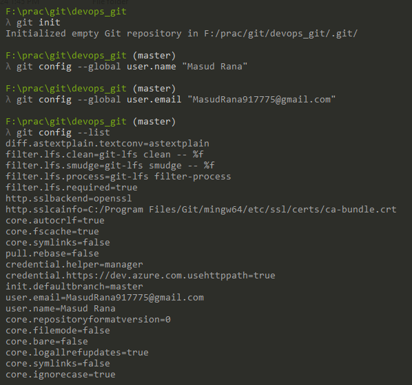

<!-- Basic Commands -->

## Basic Commands

### `git config`

Configures Git settings, such as user information for commits.

```bash
git config --global user.name "Masud Rana"
git config --global user.email "MasudRana799dev@gmail.com"
```

### `git --version`

Displays the installed version of Git.

```bash
git --version
```

### `git help`

Displays help information for Git commands.

```bash
git help
git help commit
```

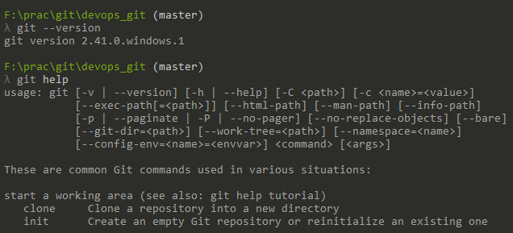

<!-- Creating Snapshots -->

## Creating Snapshots

Git allows you to take "snapshots" of your code at specific points in time. This helps in saving changes and tracking progress over time.

### `git init`

Initializes a new Git repository in the current directory.

```bash
git init
```

### `git add`

Stages files to be included in the next commit.

```bash
git add file1.js # Stages a single file
git add file1.js file2.js # Stages multiple files
git add *.js # Stages with a pattern
git add . # Stages the current directory and all its content
```

### `git commit`

Commits the staged changes with a message.

```bash
git commit -m "Initial commit"
git commit --amend # Amend the previous commit (modify message or add changes)
```

### `git status`

Displays the status of the working directory and the staging area.

```bash
git status
```

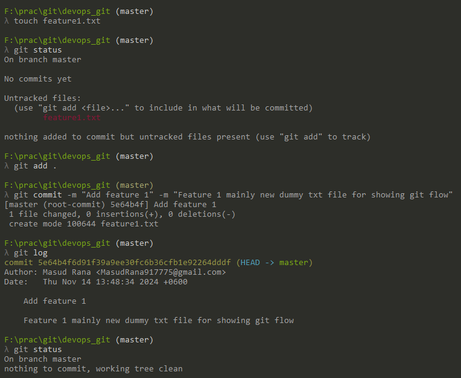

### `git stash`

Temporarily saves changes that are not ready to be committed, so you can work on something else.

```bash
git stash                             # Save changes to the stash
git stash pop                         # Apply the most recent stash and remove it from the stash list
git stash list                        # List all saved stashes
```

- `git stash`: Temporarily saves your working directory and staging area changes.
- `git stash pop`: Applies the latest stash and removes it from the stash list.
- `git stash list`: Lists all saved stashes.

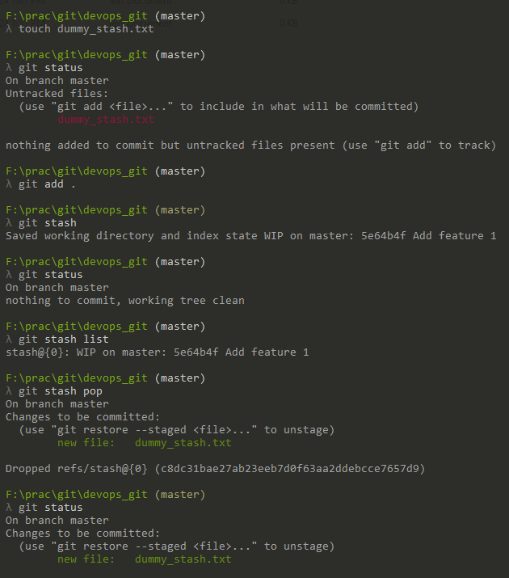

### `git tag`

Creates a snapshot of the repository at a specific point in time, often used to mark release points.

```bash
git tag <tag-name>                    # Create a new tag
git tag -a <tag-name> -m "Message"    # Create an annotated tag with a message
git tag -d <tag-name>                 # Delete a tag

git tag v1.0 # Creates a lightweight tag for version 1.0
git tag -a v1.0 -m "Version 1.0 release" # Creates an annotated tag with a message
```

- `git tag`: Creates a lightweight tag at the current commit.
- `git tag -a`: Creates an annotated tag with a message and additional metadata.
- `git tag -d`: Deletes a tag.

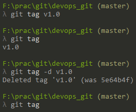

<!-- Browsing History -->

## Browsing History

Git provides commands to inspect and navigate through the commit history.

### `git log`

Displays the commit history with details like commit hash, author, date, and message.

```bash
git log                               # Show the commit history for the current branch
git log --oneline                     # Show a simplified commit history (one commit per line)
git log --graph                       # Show a visual representation of the commit history in a graph format
git log --author="Author Name"        # Show commits by a specific author
git log --since="2 weeks ago"         # Show commits made in the last 2 weeks
git log --until="2023-01-01"          # Show commits made before January 1st, 2023
git log --oneline --graph --decorate  # Show a simplified graph with branch names and tags
git log <branch-name>                 # Show the commit history for a specific branch
```

### `git show`

Displays details about a specific commit, including the changes made.

```bash
git show <commit-hash>                  # Show details of a specific commit
git show --stat <commit-hash>           # Show commit details with file statistics (added/modified lines)
git show --name-only <commit-hash>      # Show only the names of files changed in the commit
git show --pretty=oneline <commit-hash> # Show the commit in a simplified, one-line format
git show HEAD                           # Show the most recent commit (HEAD)
```

### `git diff`

Shows the changes between the working directory and the staging area.

```bash
git diff                                # Shows changes between the working directory and staging area
git diff --cached                       # Shows changes staged for the next commit
git diff <commit-hash1> <commit-hash2>  # Compare two specific commits
```

### `git blame`

Shows who made changes to each line of a file.

```bash
git blame <file-name> # Show the commit and author responsible for each line of a file
```

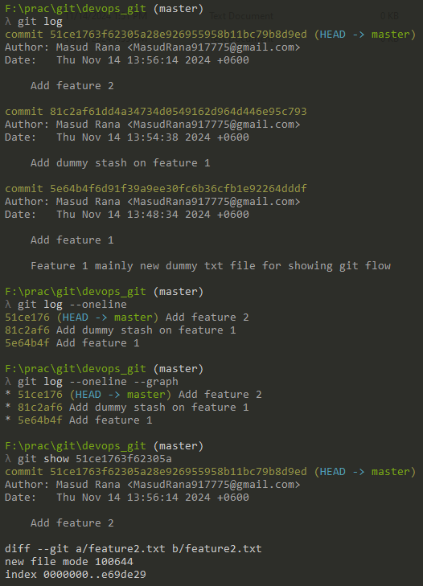

<!-- Branching & Merging -->

## Branching & Merging

Branching and merging allow for parallel development and feature integration in Git.

### `git branch`

Lists, creates, renames, deletes, and manages branches in the repository, both locally and remotely.

```bash
git branch                            # List all local branches
git branch new-branch                 # Create a new branch called 'new-branch'
git branch -d old-branch              # Delete the 'old-branch' branch
git branch -D old-branch              # Force delete the 'old-branch' branch, even if not merged
git branch -a                         # List all branches, including remote branches
git branch -r                         # List all remote branches
git branch -m old-name new-name       # Rename a branch from 'old-name' to 'new-name'
git branch -v                         # Show the latest commit on each branch
git branch --merged                   # Show branches that have already been merged into the current branch
git branch --no-merged                # Show branches that have not yet been merged into the current branch
git push origin --delete old-branch   # Delete a remote branch named 'old-branch'
git fetch --prune                     # Remove references to deleted remote branches
```

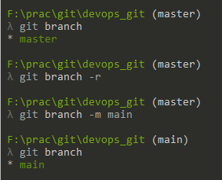

### `git checkout`

Switches to a different branch or commit.

```bash
git checkout main                     # Switch to the 'main' branch
git checkout -b new-branch            # Create a new branch 'new-branch' and switch to it
git checkout -- <file>                # Restore the file to its last committed state
```

### `git merge`

Combines changes from one branch into another.

```bash
git merge main                        # Merge the 'main' branch into the current branch
git merge feature-branch              # Merge 'feature-branch' into the current branch
git merge --no-ff main                # Perform a merge that always creates a merge commit, even if a fast-forward merge is possible
```

### `git rebase`

Reapplies commits from one branch onto another base branch.

```bash
git rebase main                       # Rebase the current branch onto 'main'
git pull --rebase origin main         # Fetch and rebase the current branch on top of 'main' from 'origin'
git pull --rebase                     # Fetch and rebase from the default remote and branch (usually 'origin' and the current branch)
```

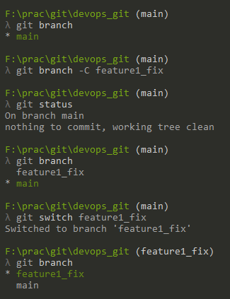

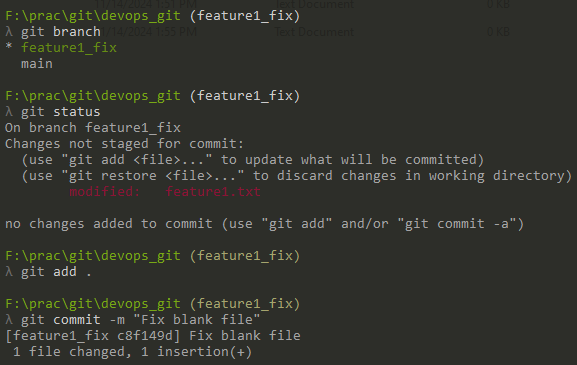

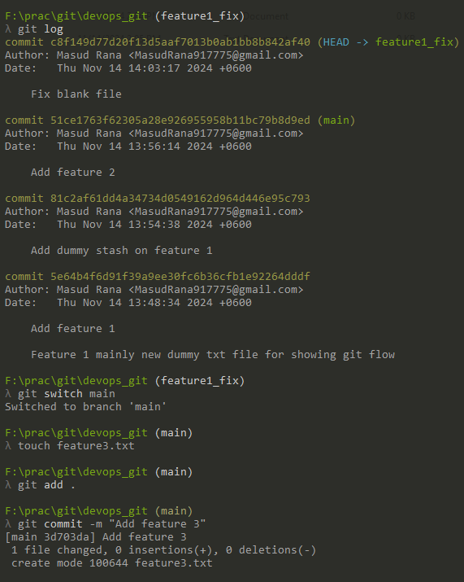

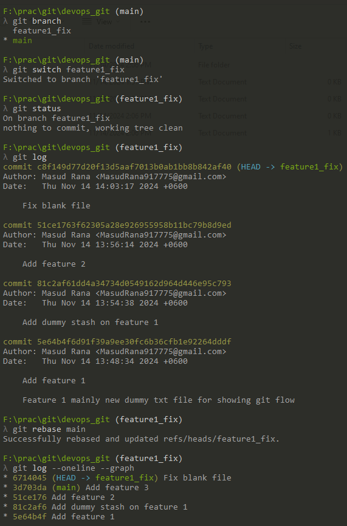

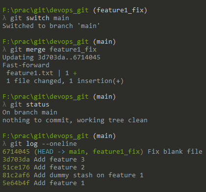

<!-- Collaboration -->

## Collaboration

Git makes it easy to work with others by connecting your local repository to remote repositories.

### `git remote`

Manages the remote repositories connected to your local project.

```bash
git remote add origin https://github.com/user/repo.git  # Add a new remote repository
git remote -v                                       # List all remote repositories associated with the current project
git remote remove origin                           # Remove the remote repository 'origin'
git remote rename origin upstream                  # Rename a remote (e.g., from 'origin' to 'upstream')
git remote show origin                             # Show detailed information about the remote 'origin'
```

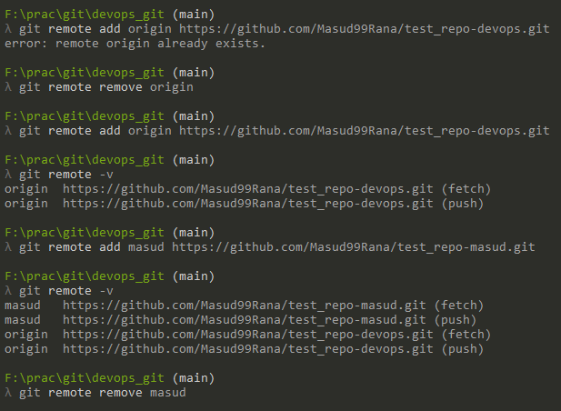

### `git push`

Uploads your local changes to a remote repository.

```bash
git push origin main                    # Push local 'main' branch to the remote 'origin'
git push origin feature-branch          # Push a specific branch to the remote
git push origin --all                   # Push all local branches to the remote
git push --force                        # Force push to overwrite remote changes (use with caution)
```

### `git pull`

Fetches changes from a remote repository and automatically merges them into the current branch, updating your working directory.

```bash
git pull origin main                    # Pull updates from the 'main' branch of the 'origin' remote
git pull --rebase origin main            # Pull updates with rebase instead of merge
git pull --all                          # Pull updates from all remotes
```

### `git fetch`

Downloads updates from a remote repository without merging them.

```bash
git fetch origin                        # Fetch updates from the default remote (origin)
git fetch origin main                    # Fetch updates for a specific branch (e.g., 'main')
git fetch --all                          # Fetch updates for all remotes
git fetch --prune                        # Prune deleted branches from the remote
```

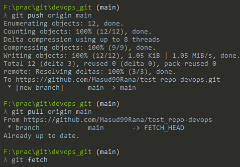

### `git clone`

Creates a local copy of a remote repository.

```bash
git clone git@github.com:user/repository.git
```

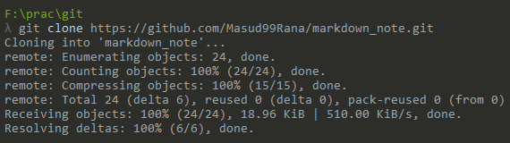

<!-- Rewriting History-->

## Rewriting History

Sometimes, you may want to modify previous commits. Git provides tools for rewriting history, but use these with caution.

### `git commit --amend`

Modifies the most recent commit with new changes or a new commit message.

```bash
git commit --amend                  # Amend the last commit (change the commit message)
git commit --amend --no-edit         # Amend the last commit without changing the commit message
git commit --amend -m "New message"  # Amend the last commit with a new message
```

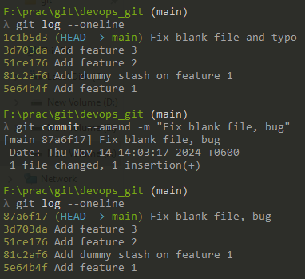

### `git reflog`

Displays the reference log, showing a list of all changes made to the HEAD pointer, including commits, resets, rebases, and checkouts.

```bash
git reflog                     # View the history of changes to the HEAD
git reset --hard HEAD@{3}      # Reset the current branch to the state at the 3rd reflog entry
git checkout HEAD@{1}          # Checkout the commit at the 1st reflog entry
```

- **HEAD@{n}**: Refers to the nth entry in the reflog.
- **View History**: Helps track all modifications made to the HEAD, even if the commits are no longer visible in git log.
- **Recover Commits**: Useful for finding and restoring lost commits after a reset or rebase.

### `git rebase`

Reapplies commits on top of another base branch, allowing for a cleaner project history.

```bash
git rebase main              # Rebase the current branch onto the main branch
git rebase -i HEAD~3         # Interactive rebase for the last 3 commits
git rebase --continue        # Continue the rebase after resolving conflicts
git rebase --abort           # Abort the rebase process and return to the original state
```

- `git rebase main`: Moves the current branch commits to the tip of the main branch.
- `-i` (Interactive): Allows you to edit, squash, or drop commits during the rebase process.
- `--continue`: Proceeds with the rebase after resolving merge conflicts.
- `--abort`: Cancels the rebase operation and restores the branch to its original state.

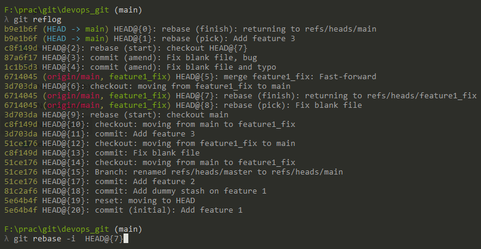

### `git rebase -i`

Performs an interactive rebase, allowing you to squash, edit, or drop commits.

```bash
git rebase -i HEAD~3 # Start an interactive rebase for the last 3 commits
```

- **`pick`**: Use the commit as-is.
- **`edit`**: Pause the rebase to modify the commit (e.g., change the commit message).
- **`squash`**: Combine this commit with the previous one, merging their changes and messages.
- **`drop`**: Remove the commit from the history.

### `git reset`

Moves the current branch to a specified commit, with options to keep or discard changes.

```bash
git reset --soft HEAD~1   # Keep changes staged
git reset --mixed HEAD~1  # Default option; unstage changes but keep them in the working directory
git reset --hard HEAD~1   # Discard changes completely
```

- `--soft`: Keeps the changes in the staging area.
- `--mixed` (Default): Keeps the changes in the working directory but unstages them.
- `--hard`: Discards all changes in both the staging area and working directory.

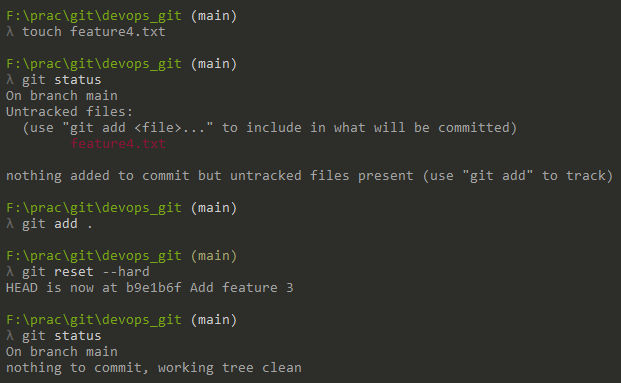

### `git cherry-pick`

Applies the changes from a specific commit onto your current branch.

```bash
git cherry-pick abc1234             # Apply a single commit to the current branch
git cherry-pick abc1234 def5678     # Apply multiple commits to the current branch
git cherry-pick A..B                # Apply all commits between commit A (exclusive) and B (inclusive)
git cherry-pick -n abc1234          # Apply the commit without creating a new commit (stages changes only)
```

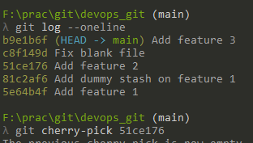

### `git revert`

Creates a new commit that undoes the changes of a specified commit.

```bash
git revert abc1234                # Revert a specific commit
git revert HEAD                   # Revert the latest commit
git revert -n abc1234             # Revert a commit without committing the changes (stages the changes only)
git revert abc1234..def5678       # Revert a range of commits (from abc1234 to def5678, exclusive of the start)
```

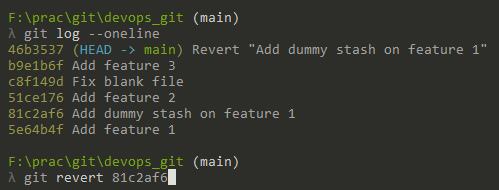

<!-- Demonstrating -->

# Concept

## What is upstream?

In Git, **"upstream"** refers to the remote repository or branch from which your local branch is derived or the repository you are collaborating with. It is typically the main source of updates that you pull from or push to in collaborative projects.

### Common scenarios for **upstream**:

1.  **Upstream Repository**:

    - If you fork a repository, the original repository is often referred to as the **upstream repository**, while your fork is considered the **origin**.
    - You pull changes from the upstream repository to keep your fork up-to-date.

2.  **Upstream Branch**:

    - When you create a local branch based on a remote branch (often on a repository like `origin`), this remote branch is referred to as the **upstream branch**.
    - For example, if you are working on a local branch `feature-branch` and you want to track the remote `main` branch, `main` would be the upstream branch.

### Key Commands Related to Upstream:

- To check the current upstream configuration for your branch:
  `git branch -vv`
  This shows which remote branch is set as the upstream for your local branch.
- To set an upstream branch:
  `git branch --set-upstream-to=origin/main`
- To fetch updates from the upstream repository:
  `git fetch upstream`
- To merge upstream changes into your local branch:
  `git merge upstream/main`

### In summary:

- **Upstream** is the remote repository or branch that your local repository tracks.
- It helps to keep your local repository in sync with changes from a central or original repository.

## The difference between revert, rebase, and reset?

The **`git revert`**, **`git rebase`**, and **`git reset`** commands are often used to modify the history of a Git repository, but they serve very different purposes and have distinct behaviors. Here’s a breakdown of the differences:

### 1. **`git revert`**:

- **Purpose**: Creates a new commit that undoes the changes introduced by a previous commit. It does not alter the commit history, and the original commit remains in the history.
- **Use case**: When you want to undo changes but maintain a clean and traceable history. Ideal for public repositories or collaborative work.
- **Behavior**: The original commit remains in the history, and a new commit is created to "reverse" the changes.
- **Example**:
  `git revert <commit_hash>`

  This will create a new commit that undoes the changes made in `<commit_hash>`.

---

### 2. **`git rebase`**:

- **Purpose**: Moves or reapplies commits from one branch onto another base branch. It changes the base of your branch to another commit, making the history linear.
- **Use case**: When you want to make your feature branch appear as if it was built from the latest state of the base branch (usually `main` or `master`). Rebase is useful for cleaning up your commit history before merging.
- **Behavior**: Rewrites commit history by changing the parent commit of your branch.
- **Example**:
  `git rebase main`
  This will rebase the current branch onto the latest commit of the `main` branch, replaying your changes on top of it.

---

### 3. **`git reset`**:

- **Purpose**: Resets your current HEAD to a specified state. It can be used to unstage changes, move back to a previous commit, or delete commits entirely.
- **Use case**: When you want to undo changes in your working directory or uncommit some changes (without deleting them permanently).
- **Behavior**: Can be used with three options (`--soft`, `--mixed`, and `--hard`), each of which behaves differently:
  - **`--soft`**: Resets HEAD to the specified commit, but keeps changes staged for commit.
  - **`--mixed`**: Resets HEAD to the specified commit, and unstages the changes (default behavior).
  - **`--hard`**: Resets HEAD, working directory, and index to the specified commit, discarding all changes.
- **Example**:
  - **Soft Reset** (keeps changes staged):
    `git reset --soft HEAD~1`
  - **Hard Reset** (discards all changes):
    `git reset --hard HEAD~1`

---

### Key Differences:

| **Command**  | **Purpose**                                                       | **History Impact**                                                        | **Use Case**                                                                                             |
| ------------ | ----------------------------------------------------------------- | ------------------------------------------------------------------------- | -------------------------------------------------------------------------------------------------------- |
| `git revert` | Reverses a commit by adding a new commit that undoes the changes. | Does not modify commit history, adds a new commit.                        | Undoing changes in a public branch, preserving history.                                                  |
| `git rebase` | Re-applies commits on top of another commit, rewriting history.   | Rewrites commit history to create a linear history.                       | Reorganizing commits to make a clean history before merging.                                             |
| `git reset`  | Resets the current branch to a previous commit.                   | Rewrites history depending on the option (`--soft`, `--mixed`, `--hard`). | Unstaging changes, moving HEAD, or removing commits (with danger of losing changes if `--hard` is used). |

### Summary:

- **Revert** is safe for public repositories because it preserves history.
- **Rebase** is great for cleaning up history in private branches but can rewrite history, so it’s typically not used on public branches.
- **Reset** is powerful but should be used with caution because it can permanently delete commits or changes, especially with `--hard`.

<!-- Demonstrating -->

# Demonstrating

## SSH Configuration and Setup

### Why Use SSH?

Using SSH for Git allows for secure communication with remote repositories without needing to enter your username and password every time. It is a safer and more efficient way to handle authentication.

### Steps to Configure SSH

1. **Generate a New SSH Key**
   Create a new SSH key using your email as a label:
   ```bash
   ssh-keygen -t ed25519 -C "MasudRana799dev@gmail.com"
   ```
2. **Add SSH Key to the SSH Agent**
   Start the SSH agent and add your SSH private key:

   ```bash
   eval "$(ssh-agent -s)"
   ssh-add ~/.ssh/id_ed25519
   ```

3. **Copy the SSH Key**
   Copy the SSH public key to your clipboard:

   ```bash
   cat ~/.ssh/id_ed25519.pub
   ```

4. **Add SSH Key to GitHub**
   Copy the SSH public key to your clipboard:

   - Go to **GitHub > Settings > SSH and GPG keys > New SSH key**.
   - Paste the copied SSH key and give it a title.

5. **Test SSH Connection**
   Verify that your SSH key was added correctly:
   ```bash
   ssh -T git@github.com
   ```
   If successful, you should see a welcome message like:
   ```vbnet
    Hi username! You've successfully authenticated, but GitHub does not provide shell access.
   ```
6. **Using SSH with Git Commands**
   To clone a repository using SSH:
   ```bash
   git clone git@github.com:Masud99Rana/ic-devops-batch3.git
   ```

## **Collaboration in a Team Project**

When contributing to a shared repository, the typical flow involves forking the repository, creating a new branch, making changes, syncing with the main branch, and submitting a pull request. This section demonstrates how to follow these steps to collaborate in a team project using Git and GitHub.

### **Step-by-Step Process to Collaborate in a Team Project**

### **1. Fork the Repository**

When you want to contribute to an existing project, the first step is to **fork** the repository. Forking creates a personal copy of the repository in your GitHub account.

**Steps**:

- Go to the GitHub repository you want to contribute to.
- Click on the **Fork** button at the top right of the repository page.
- After forking, you will have your own copy of the repository under your GitHub account.

---

### **2. Clone the Forked Repository**

Once the repository is forked, clone it to your local machine to start working on it.

**Steps**:

- Copy the URL of your forked repository from GitHub (you can use HTTPS or SSH).
- Open a terminal and run the following command:
  ```bash
  git clone https://github.com/yourusername/repository-name.git
  ```
  Replace `yourusername` and `repository-name` with your actual GitHub username and the repository name.

---

### **3. Create a New Branch**

Now that you have cloned the repository, create a new branch to work on a specific feature or fix a bug. This is important to ensure you don’t make changes directly to the `main` branch.

**Steps**:

- Navigate to the repository directory:

  ```bash
  cd repository-name
  ```

- Create and switch to a new branch:
  ```bash
  git checkout -b your-branch-name
  ```
  Replace `your-branch-name` with a descriptive name for the branch (e.g., `feature/add-login` or `bugfix/fix-navbar`).

---

### **4. Make Changes and Commit Them**

Now, make the necessary changes to the codebase. After making changes, add and commit them to your branch.

**Steps**:

- Add the changes to the staging area:

  ```bash
  git add .
  ```

- Commit the changes with a meaningful message:
  ```bash
  git commit -m "Add new login functionality"
  ```

---

### **5. Sync with the Original Repository (Rebase)**

Before pushing your changes, it's a good practice to sync your branch with the latest changes from the original repository to avoid conflicts.

**Steps**:

- Add the original repository as a remote:

  ```bash
  git remote add upstream https://github.com/original-owner/repository-name.git
  ```

- Fetch the latest changes from the original repository:

  ```bash
  git fetch upstream
  ```

- Rebase your branch on top of the latest `main` branch:

      ```bash
      git rebase upstream/main
      ```

  This will replay your changes on top of the latest code from the `main` branch.

---

### **6. Push Changes to Your Forked Repository**

Once your branch is up to date with the original repository and your changes are committed, push your branch to your forked repository on GitHub.

**Steps**:

- Push the changes to your forked repository:

  ```bash
  git push origin your-branch-name
  ```

---

### **7. Create a Pull Request (PR)**

After pushing your changes, you can create a pull request (PR) to propose your changes to the original repository.

**Steps**:

- Go to your forked repository on GitHub.
- You’ll see a prompt to create a **Pull Request** for the branch you just pushed.
- Click on the **New Pull Request** button.
- Select `main` (or the default branch) of the original repository as the base branch, and select your branch from your fork as the compare branch.
- Add a description of the changes you made, then click **Create Pull Request**.

---

### **8. Review and Merge**

Once the pull request is submitted, the repository maintainers will review your changes. They might request some changes or approve the pull request.

**Steps**:

- If there are requested changes, make the changes in your branch, commit them, and push again. The pull request will automatically update.
- Once approved, the maintainers will merge your pull request into the `main` branch of the original repository.

<!-- CONTRIBUTING -->

`## Contributing

## Contributing

Any contributions you make are **greatly appreciated**.

To contribute to this project, please follow the steps below:

1. **Fork the Project**  
   Click the "Fork" button at the top-right of the repository page to create a copy under your GitHub account. You can find the repository [here](https://github.com/Masud99Rana/markdown_note.git).

2. **Clone your Forked Repository**  
   Clone the repository to your local machine:
   ```bash
   git clone https://github.com/Masud99Rana/markdown_note.git
   ```
3. **Create a Feature Branch**  
   Navigate to the project folder and create a new branch for your feature or fix:
   ```bash
   git checkout -b feature/newFeature
   ```
   Replace `newFeature` with a descriptive name for your branch.
4. **Commit your Changes**  
   After making changes, stage and commit them:

   ```bash
   git add .
   git commit -m 'Add some newFeature'
   ```

5. **Push to your Fork**  
   Push your changes to your forked repository on GitHub:

   ```bash
   git push origin feature/newFeature
   ```

6. **Open a Pull Request**  
   Go to the original repository on GitHub, and you’ll see an option to **Create Pull Request**. Select your feature branch and submit the pull request for review.

<!-- CONTACT -->

## Contact

### Md. Masud Rana

[![My LinkedIn Profile][linkedin-shield]][linkedin-url]
[![Gmail][gmail-shield]][gmail-url]

## Heartiest Thanks

- Thank you so much! :sparkling_heart:
- Special thanks for reviewing this README and providing feedback!

<!-- MARKDOWN LINKS & IMAGES -->
<!--  https://github.com/tchapi/markdown-cheatsheet -->
<!-- https://www.webfx.com/tools/emoji-cheat-sheet/ -->
<!-- https://www.markdownguide.org/basic-syntax/#reference-style-links -->

[masud-version]: https://img.shields.io/badge/Masud-v7.8.*-blue?style=flat-square
[status-shield]: https://img.shields.io/badge/Status-finished-success?style=flat-square
[laravel-shield]: https://img.shields.io/badge/laravel-v5.8-555.svg?style=flat-square&logo=laravel&labelColor=FF2D20&logoColor=fff
[laravel-url]: https://laravel.com
[vue-shield]: https://img.shields.io/badge/vue.js-v2.8-black.svg?style=flat-square&logo=vue.js&color=#4FC08D
[vue-url]: https://vuejs.org/
[php-shield]: https://img.shields.io/badge/php-v2.8-555.svg?style=flat-square&logo=php&labelColor=777BB4&logoColor=fff
[php-url]: https://php.net
[javascript-shield]: https://img.shields.io/badge/-JavaScript-555.svg?style=flat-square&logo=javascript&labelColor=F7DF1E&logoColor=fff
[javascript-url]: https://developer.mozilla.org/en-US/docs/Web/JavaScript
[lumen-shield]: https://img.shields.io/badge/Lemen-v1.7-555.svg?style=flat-square&logo=lumen&labelColor=E74430&logoColor=fff
[lumen-url]: https://lumen.laravel.com/
[npm-shield]: https://img.shields.io/badge/npm-v2.8-CB3837.svg?style=flat-square&logo=npm
[npm-url]: https://nodejs.org/en/
[nodejs-shield]: https://img.shields.io/badge/Node.Js-v1.7-555.svg?style=flat-square&logo=node.js&labelColor=339933&logoColor=fff
[nodejs-url]: https://nodejs.org/en/
[bootstrap-shield]: https://img.shields.io/badge/Bootstrap-v1.7-success.svg?style=flat-square&logo=bootstrap&labelColor=563D7C&logoColor=fff
[bootstrap-url]: https://getbootstrap.com/
[madewith-shield]: https://img.shields.io/badge/R-Made%20With%20Love-success?style=flat-square&labelColor=00cec9&logo=monzo&logoColor=fff&color=00b894
[linkedin-shield]: https://img.shields.io/badge/-MasudRana99mr-black.svg?style=flat-square&logo=linkedin&color=555
[linkedin-url]: https://www.linkedin.com/in/masudrana99mr
[gmail-shield]: https://img.shields.io/badge/-MasudRana799dev@gmail.com-555.svg?style=flat-square&logo=gmail&labelColor=D14836&logoColor=fff
[gmail-url]: mailto::MasudRana799dev@gmail.com

<!-- My Note -->
<!--
*** 
***
*** [screenshot]: images/screenshot.png
*** [![Product Name Screen Shot][screenshot]](https://example.com)
***
***
***
***
***
***
-->
