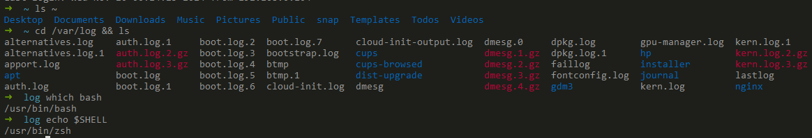
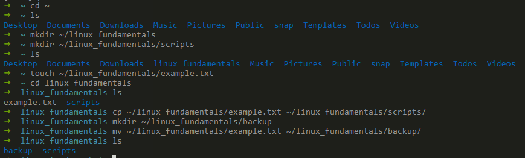
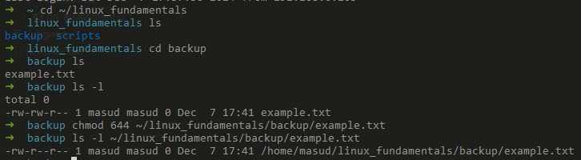
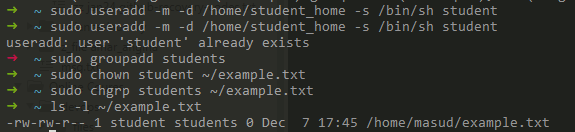
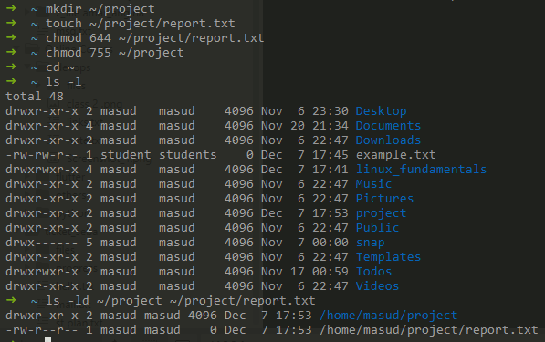
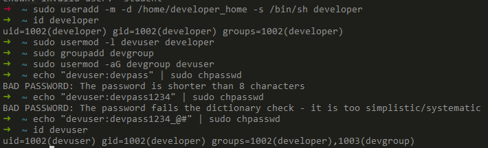
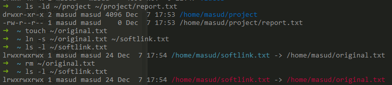
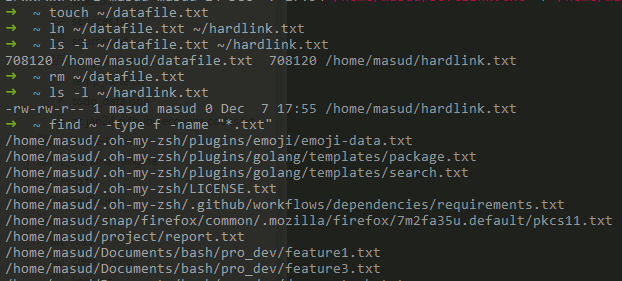
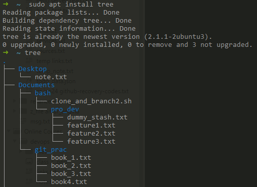

<!--
*** Md. Masud Rana
*** Mail: MasudRana799dev@gmail.com
*** The design of this template took my 1 day  - learning markdown concept and make this file.
*** Happy Learning, Happy Coding.
[![Made with love by Masud Rana][madewith-shield]][linkedin-url]
[![status][status-shield]][linkedin-url]
[![Laravel][laravel-shield]][laravel-url]
[![PHP][php-shield]][php-url]
[![lumen][lumen-shield]][lumen-url]
[![Vue js][vue-shield]][vue-url]
[![NPM][npm-shield]][npm-url]
[![Node Js][nodejs-shield]][nodejs-url]
[![javascript][javascript-shield]][javascript-url]
[![bootstrap][bootstrap-shield]][bootstrap-url]
<a href="https://en.wikipedia.org/wiki/Bangladesh">  </a>
[![My LinkedIn Profile][linkedin-shield]][linkedin-url]
[![Gmail][gmail-shield]][gmail-url]
-->

# Linux Fundamentals - Assignment 1

> **Note:** Instructions in assignment_instruction.txt

[![Made with love by Your Name][madewith-shield]][linkedin-url]
[![status][status-shield]][linkedin-url]

<a href="https://en.wikipedia.org/wiki/Bangladesh">  </a>
[![My LinkedIn Profile][linkedin-shield]][linkedin-url]
[![Gmail][gmail-shield]][gmail-url]

---

## About This File

This file contains a comprehensive list of core Linux commands with brief descriptions and examples, covering essential topics such as:

- **File System Navigation**: Commands to explore the Linux file system.
- **File and Directory Operations**: Tasks related to file creation, modification, and management.
- **Permissions**: Managing file and directory permissions to ensure proper access control.
- **File Modification**: Modifying files and managing ownership and group.
- **Ownership**: Setting up and managing file ownership and group settings.
- **User Management**: Creating and modifying users, and setting up user permissions.
- **Hard/Soft Links**: Understanding and using hard and symbolic links.
- **Package Installation**: Installing packages using the apt package manager.

---

## Table of Contents

1. [File System Navigation](#file-system-navigation)
2. [File and Directory Operations](#file-and-directory-operations)
3. [Permissions](#permissions)
4. [File Modification](#file-modification)
5. [Ownership](#ownership)
6. [User Add/Modify](#user-addmodify)
7. [Hard/Soft Link](#hardsoft-link)
8. [Package Installation](#package-installation)

## File System Navigation

- **Commands**:

  ```bash
  # List the contents of the home directory
  ls ~

  # Change the current directory to /var/log and list its contents
  cd /var/log && ls

  # Find and display the path to the bash executable using the `which` command
  which bash

  # Find current shell
  echo $SHELL
  ```

  

## File and Directory Operations

- **Commands**:

  ```bash
    # Create a directory named linux_fundamentals in home directory
    mkdir ~/linux_fundamentals

    # Inside linux_fundamentals, create a subdirectory named scripts
    mkdir ~/linux_fundamentals/scripts

    # Create an empty file named example.txt inside the linux_fundamentals directory
    touch ~/linux_fundamentals/example.txt

    # Copy example.txt to the scripts directory
    cp ~/linux_fundamentals/example.txt ~/linux_fundamentals/scripts/

    # Move example.txt from linux_fundamentals to linux_fundamentals/backup
    mkdir ~/linux_fundamentals/backup
    mv ~/linux_fundamentals/example.txt ~/linux_fundamentals/backup/

  ```

  

## Permissions

- **Commands**:

  ```bash
    # Change the permissions of example.txt
    chmod 644 ~/linux_fundamentals/backup/example.txt

    # Verify the permission changes
    ls -l ~/linux_fundamentals/backup/example.txt

  ```

  

## File Modification

- **Commands**:

  ```bash
    # Create a file named example.txt in home directory
    touch ~/example.txt

    # Change the owner to a user named student
    sudo chown student ~/example.txt

    # Change the group to a group named students
    sudo chgrp students ~/example.txt

    # Verify the changes
    ls -l ~/example.txt

  ```

  

## Ownership

- **Commands**:

  ```bash
    # Create a directory named project in home directory
    mkdir ~/project

    # Create a file named report.txt inside the project directory
    touch ~/project/report.txt

    # Set the permissions of report.txt
    chmod 644 ~/project/report.txt

    # Set the permissions of the project directory
    chmod 755 ~/project

    # Verify the changes
    ls -ld ~/project ~/project/report.txt

  ```

  

## User Add/Modify

- **Commands**:

  ```bash
    # Create a new user named developer
    sudo useradd -m -d /home/developer_home -s /bin/sh developer

    # Verify the new user's information
    id developer

    # Change the username to devuser
    sudo usermod -l devuser developer

    # Add devuser to a group named devgroup
    sudo groupadd devgroup
    sudo usermod -aG devgroup devuser

    # Set the password of devuser to devpass
    echo "devuser:devpass" | sudo chpasswd

    # Verify changes
    id devuser
  ```

  

## Hard/Soft Link

- **Commands**:

  ```bash
    # Create a file named original.txt in home directory
    touch ~/original.txt

    # Create a symbolic link named softlink.txt
    ln -s ~/original.txt ~/softlink.txt

    # Verify the symbolic link
    ls -l ~/softlink.txt

    # Delete the original file and observe the status
    rm ~/original.txt
    ls -l ~/softlink.txt

    # Create a hard link named hardlink.txt
    touch ~/datafile.txt
    ln ~/datafile.txt ~/hardlink.txt

    # Verify the hard link
    ls -i ~/datafile.txt ~/hardlink.txt

    # Delete the original file and observe the status
    rm ~/datafile.txt
    ls -l ~/hardlink.txt

    # Find all .txt files in home directory
    find ~ -type f -name "*.txt"

  ```

  

  

## Package Installation

- **Commands**:

  ```bash
    # Update repo cache
    sudo apt update

    # Install the tree package
    sudo apt install tree

    # Install gcloud CLI tool
    sudo apt install apt-transport-https ca-certificates gnupg
    echo "deb [signed-by=/usr/share/keyrings/cloud.google.gpg] https://packages.cloud.google.com/apt cloud-sdk main" | sudo tee -a /etc/apt/sources.list.d/google-cloud-sdk.list
    curl https://packages.cloud.google.com/apt/doc/apt-key.gpg | sudo apt-key add -
    sudo apt update && sudo apt install google-cloud-sdk

  ```

  

<!-- CONTACT -->

## Contact

### Md. Masud Rana

[![My LinkedIn Profile][linkedin-shield]][linkedin-url]
[![Gmail][gmail-shield]][gmail-url]

## Heartiest Thanks

- Thank you so much! :sparkling_heart:
- Special thanks for reviewing this README and providing feedback!

<!-- MARKDOWN LINKS & IMAGES -->
<!--  https://github.com/tchapi/markdown-cheatsheet -->
<!-- https://www.webfx.com/tools/emoji-cheat-sheet/ -->
<!-- https://www.markdownguide.org/basic-syntax/#reference-style-links -->

[masud-version]: https://img.shields.io/badge/Masud-v7.8.*-blue?style=flat-square
[status-shield]: https://img.shields.io/badge/Status-finished-success?style=flat-square
[laravel-shield]: https://img.shields.io/badge/laravel-v5.8-555.svg?style=flat-square&logo=laravel&labelColor=FF2D20&logoColor=fff
[laravel-url]: https://laravel.com
[vue-shield]: https://img.shields.io/badge/vue.js-v2.8-black.svg?style=flat-square&logo=vue.js&color=#4FC08D
[vue-url]: https://vuejs.org/
[php-shield]: https://img.shields.io/badge/php-v2.8-555.svg?style=flat-square&logo=php&labelColor=777BB4&logoColor=fff
[php-url]: https://php.net
[javascript-shield]: https://img.shields.io/badge/-JavaScript-555.svg?style=flat-square&logo=javascript&labelColor=F7DF1E&logoColor=fff
[javascript-url]: https://developer.mozilla.org/en-US/docs/Web/JavaScript
[lumen-shield]: https://img.shields.io/badge/Lemen-v1.7-555.svg?style=flat-square&logo=lumen&labelColor=E74430&logoColor=fff
[lumen-url]: https://lumen.laravel.com/
[npm-shield]: https://img.shields.io/badge/npm-v2.8-CB3837.svg?style=flat-square&logo=npm
[npm-url]: https://nodejs.org/en/
[nodejs-shield]: https://img.shields.io/badge/Node.Js-v1.7-555.svg?style=flat-square&logo=node.js&labelColor=339933&logoColor=fff
[nodejs-url]: https://nodejs.org/en/
[bootstrap-shield]: https://img.shields.io/badge/Bootstrap-v1.7-success.svg?style=flat-square&logo=bootstrap&labelColor=563D7C&logoColor=fff
[bootstrap-url]: https://getbootstrap.com/
[madewith-shield]: https://img.shields.io/badge/R-Made%20With%20Love-success?style=flat-square&labelColor=00cec9&logo=monzo&logoColor=fff&color=00b894
[linkedin-shield]: https://img.shields.io/badge/-MasudRana99mr-black.svg?style=flat-square&logo=linkedin&color=555
[linkedin-url]: https://www.linkedin.com/in/masudrana99mr
[gmail-shield]: https://img.shields.io/badge/-MasudRana799dev@gmail.com-555.svg?style=flat-square&logo=gmail&labelColor=D14836&logoColor=fff
[gmail-url]: mailto::MasudRana799dev@gmail.com

<!-- My Note -->
<!--
*** 
***
*** [screenshot]: images/screenshot.png
*** [![Product Name Screen Shot][screenshot]](https://example.com)
***
***
***
***
